# Legacy-Ergebnisbericht: Online-Delta-SA auf den Basics-Benchmarks

## 1. Status und Datenbasis

Dieser archivierte Bericht dokumentiert das inzwischen als
`legacy_methodology_v1` markierte Evaluationsprofil `tuned_20260530`.

Die Ergebnisse bleiben als Provenienz erhalten, sind aber keine aktive
Evaluationsbasis mehr. Die damalige Pipeline verbrauchte Mini-Batches auch nach
abgelehnten Kandidaten und interpretierte ein Validation-selektiertes
Zwischenlayout als primaeres SA-Ergebnis. Der Mayer-korrigierte Hauptpfad nutzt
stattdessen den Endzustand und laesst abgelehnte Kandidaten weder Gewichte noch
Batch-Cursor veraendern.
Die zugrunde liegenden Artefakte liegen unter:

```text
outputs/hyperparameter_tuning/20260530_143043_overnight
```

Die Hyperparameter wurden ausschließlich anhand von Validation-Metriken
ausgewählt. Testmetriken wurden erst in der finalen Confirmation-Phase
berechnet. Die maschinenlesbaren Parameter sind versioniert in:

```text
configs/evaluation_profiles.json
```

Jeder Benchmark wurde in der Confirmation-Phase mit `30` Runs ausgewertet.
Jeder Online-Delta-Run beginnt mit einem zufälligen gemischten Layout und nutzt
ausschließlich die Nachbarschaftsoperation `set_neuron`.

## 2. Was genau wird verglichen?

Online-Delta-SA hat zwei verschiedene Bewertungsebenen. Diese dürfen nicht
verwechselt werden.

### 2.1 Suchverlauf mit geerbten Gewichten

Während der SA-Suche werden Layoutänderungen online geprüft:

1. Ein Hidden-Neuron wird gleichverteilt ausgewählt.
2. Seine Aktivierungsfunktion wird durch eine andere Basics-AF ersetzt.
3. Aktuelles Layout und Kandidat werden mit denselben Gewichten und demselben
   Mini-Batch bewertet.
4. Aus der Batch-Loss-Differenz entsteht das Online-Delta:

```text
Online-Delta = Kandidaten-Batch-Loss - aktueller Batch-Loss
```

Ein negatives Delta ist eine lokale Verbesserung. Ein positives Delta kann
abhängig von der Temperatur trotzdem akzeptiert werden. Nach akzeptierten
Schritten wird das Modell auf dem Mini-Batch weitertrainiert.

Die Progress-Plots zeigen den Validation-Loss des dabei geerbten, laufend
aktualisierten Modells. Sie beantworten:

> Lernt und bewegt sich der Online-Delta-Prozess numerisch sinnvoll?

### 2.2 Fairer Layoutvergleich nach vollständigem Retraining

Für die fachliche Aussage über Aktivierungs-Layouts werden die Layouts nach der
Suche mit frisch initialisierten Gewichten vollständig neu trainiert:

- `same_random_start_retrained`: dasselbe zufällige Startlayout ohne SA-Vorteil
- `best_layout_from_sa_retrained`: bestes während SA beobachtetes Layout
- `end_layout_from_sa_retrained`: Layout am Ende der SA-Suche
- `all_relu`, `all_gelu`, `all_sigmoid`, `all_tanh`, `all_swish`,
  `all_identity`: homogene Referenzlayouts

Die zentrale Kennzahl ist:

```text
paired improvement =
  Val-Loss(same_random_start_retrained)
  - Val-Loss(best_layout_from_sa_retrained)
```

Positive Werte bedeuten: SA hat für denselben Run ein besser trainierbares
Layout als das zufällige Startlayout gefunden.

## 3. Metriken lesen

| Metrik | Bedeutung | Ziel |
| --- | --- | --- |
| `Validation-Loss` | Binary Cross Entropy auf dem Validation-Split | niedriger ist besser |
| `Validation-Accuracy` | Anteil korrekter Validation-Vorhersagen | höher ist besser |
| `Test-Loss` | Binary Cross Entropy auf dem unangetasteten Test-Split | nur final berichten |
| `Test-Accuracy` | Anteil korrekter Test-Vorhersagen | nur final berichten |
| `Acceptance Rate` | Anteil akzeptierter SA-Kandidaten | weder nahe `0` noch nahe `1` |
| `Paired Improvement` | Verbesserung des retrainierten SA-Bestlayouts gegenüber demselben Random-Start | positiv ist besser |
| `Win Rate` | Anteil der Runs mit positivem Paired Improvement | deutlich über `0.5` wäre überzeugend |
| `Layout-Hamming-Distanz` | Anteil unterschiedlicher AF-Positionen zwischen gefundenen Bestlayouts | niedrig bedeutet ähnliche Layouts |

`Validation-Loss` ist die primäre Auswahlmetrik. Testmetriken dürfen nicht zur
Layoutsuche oder Hyperparameterwahl verwendet werden.

## 4. Fixierte Hyperparameter

### 4.1 Normales Retraining

| Benchmark | Topologie | Lernrate | Epochen | Batch-Groesse | Xavier-Skalierung |
| --- | --- | ---: | ---: | ---: | ---: |
| `two_moons` | `2-8-1` | `0.2` | `400` | `64` | `2.0` |
| `concentric_circles` | `2-8-8-1` | `0.02` | `400` | `16` | `0.5` |
| `crossing_spirals` | `6-16-16-1` | `0.1` | `1500` | `8` | `0.75` |

### 4.2 Online-Delta-SA

| Benchmark | Starttemperatur | Cooling | Iterationen / Temperatur | Schritte | Online-LR | Online-Batch |
| --- | ---: | ---: | ---: | ---: | ---: | ---: |
| `two_moons` | `0.0242435` | `0.9` | `10` | `480` | `0.4` | `16` |
| `concentric_circles` | `0.0005410` | `0.9` | `10` | `480` | `0.04` | `128` |
| `crossing_spirals` | `0.0024640` | `0.98` | `10` | `480` | `0.025` | `16` |

Die deutlich unterschiedlichen Temperaturen sind gewollt. Eine Delta-Probe hat
vor der SA-Suche die Loss-Delta-Skala jedes Benchmarks vermessen.

## 5. Vergleich aller Benchmarks

### 5.1 Retrainierte Layouts

| Benchmark | SA-Bestlayout Val-Loss | Random-Baseline Val-Loss | Paired Improvement | Win Rate | Beste homogene Baseline |
| --- | ---: | ---: | ---: | ---: | --- |
| `two_moons` | `0.08893 +/- 0.02745` | `0.09072 +/- 0.02417` | `+0.00178` | `16 / 30 = 53.3 %` | `all_gelu`: `0.08391 +/- 0.02204` |
| `concentric_circles` | `0.02953 +/- 0.01551` | `0.02961 +/- 0.01759` | `+0.00008` | `16 / 30 = 53.3 %` | `all_swish`: `0.02663 +/- 0.01550` |
| `crossing_spirals` | `0.70738 +/- 0.20264` | `0.66226 +/- 0.12926` | `-0.04512` | `13 / 30 = 43.3 %` | `all_relu`: `0.63821 +/- 0.18993` |

### 5.2 Finale Testmetriken des retrainierten SA-Bestlayouts

| Benchmark | Test-Loss | Test-Accuracy |
| --- | ---: | ---: |
| `two_moons` | `0.03823 +/- 0.00863` | `0.98983 +/- 0.00398` |
| `concentric_circles` | `0.02724 +/- 0.00743` | `0.98667 +/- 0.00298` |
| `crossing_spirals` | `0.63166 +/- 0.11797` | `0.76117 +/- 0.04139` |

### 5.3 SA-Gesundheit

| Benchmark | Mittlere Acceptance Rate | Mittlerer SA-Start-Val-Loss | Mittlerer bester beobachteter Val-Loss | Mittlerer End-Val-Loss |
| --- | ---: | ---: | ---: | ---: |
| `two_moons` | `0.5056 +/- 0.0441` | `1.2108` | `0.2320` | `0.2640` |
| `concentric_circles` | `0.3065 +/- 0.0493` | `0.6955` | `0.6717` | `0.6735` |
| `crossing_spirals` | `0.6793 +/- 0.0311` | `0.6994` | `0.6830` | `0.6924` |

## 6. Benchmark: `two_moons`

### 6.1 Ergebnis

`two_moons` zeigt ein schwach positives Online-Delta-Ergebnis:

- Der laufende SA-Prozess verbessert den mittleren Validation-Loss deutlich von
  `1.2108` auf einen besten beobachteten Wert von `0.2320`.
- Nach fairem Retraining verbessert das SA-Bestlayout die gepaarte
  Random-Baseline im Mittel nur um `0.00178`.
- SA gewinnt `16` von `30` Vergleichen.
- Die homogene Referenz `all_gelu` bleibt mit `0.08391` besser als das
  retrainierte SA-Bestlayout mit `0.08893`.

Die richtige Aussage ist:

> Online-Delta-SA funktioniert auf `two_moons` als Layout-Suche, erzeugt aber
> nur einen kleinen Vorteil gegenüber zufälligen Startlayouts und keinen
> nachgewiesenen Vorteil gegenüber der besten homogenen Referenz.

### 6.2 Progress-Kurve

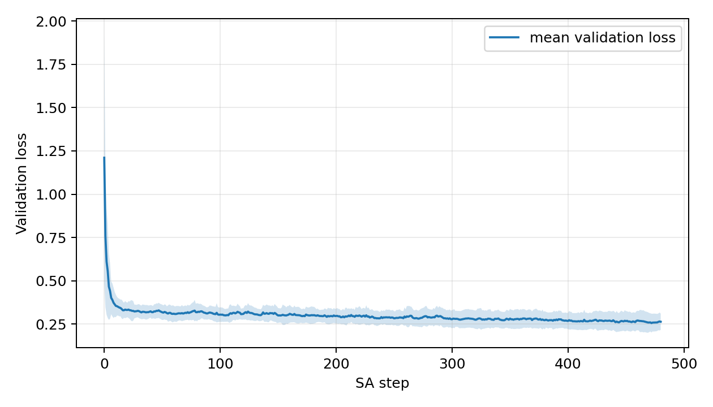

Die Kurve zeigt Mittelwert und Streuband des laufenden Validation-Loss über alle
`30` Runs. Der größte Fortschritt entsteht früh. Danach verbessert sich der
Prozess langsamer weiter. Das belegt eine funktionierende Online-Optimierung,
nicht automatisch einen starken Layoutvorteil nach Retraining.

### 6.3 Acceptance Rate

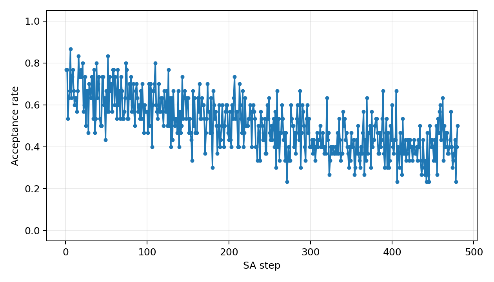

Die mittlere Acceptance Rate beträgt `0.5056`. SA akzeptiert also ungefähr die
Hälfte der Vorschläge. Der Prozess ist weder eingefroren noch ein vollständig
ungefilterter Random Walk.

### 6.4 Delta-Verteilung und Temperatur

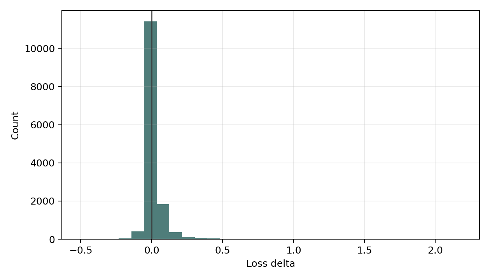

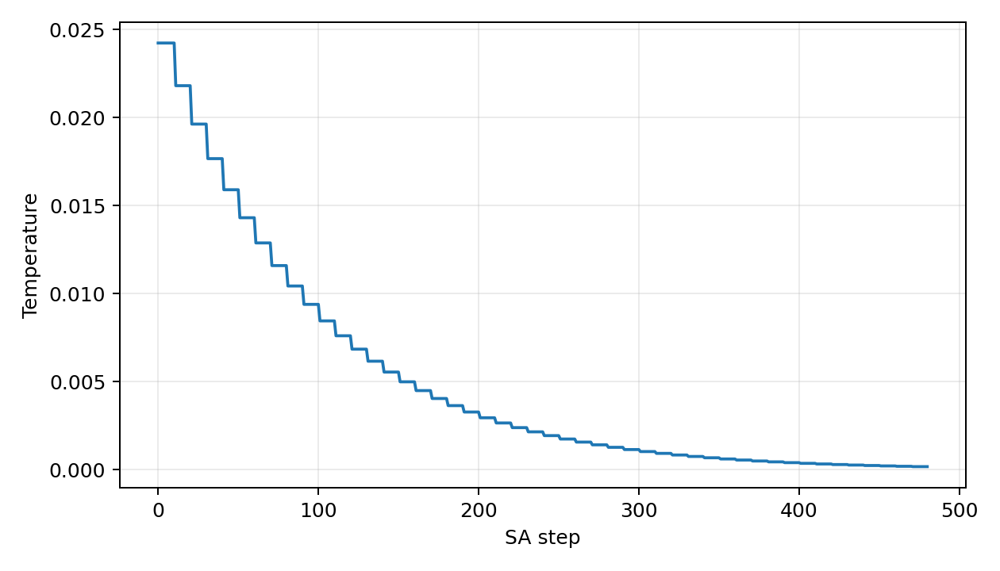

Die Delta-Verteilung zeigt die lokalen Batch-Loss-Unterschiede der
`set_neuron`-Kandidaten. Die Temperatur fällt geometrisch ab. Dadurch können
früh noch schlechtere Kandidaten akzeptiert werden, während die Suche später
selektiver wird.

### 6.5 Aktivierungsfunktionen in Bestlayouts

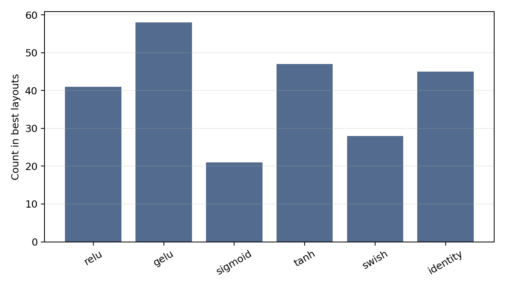

| AF | Anteil in den SA-Bestlayouts |
| --- | ---: |
| `gelu` | `24.2 %` |
| `tanh` | `19.6 %` |
| `identity` | `18.8 %` |
| `relu` | `17.1 %` |
| `swish` | `11.7 %` |
| `sigmoid` | `8.8 %` |

Es gibt keine einzelne dominante AF. Die mittlere normalisierte
Hamming-Distanz zwischen den Bestlayouts beträgt `0.8267`. Die gefundenen
Layouts unterscheiden sich also stark. SA konvergiert nicht auf ein klar
erkennbares gemeinsames Muster.

## 7. Benchmark: `concentric_circles`

### 7.1 Ergebnis

`concentric_circles` ist unter normalem Training bereits nahezu gesättigt:

- Random-Baseline: `0.02961`
- Retrainiertes SA-Bestlayout: `0.02953`
- Paired Improvement: `+0.00008`
- Win Rate: `16 / 30`
- Beste homogene Referenz `all_swish`: `0.02663`

Die richtige Aussage ist:

> Online-Delta-SA ist numerisch stabil, aber auf `concentric_circles`
> praktisch neutral. Der Benchmark bietet unter den fixierten Bedingungen nur
> wenig Raum für eine relevante Verbesserung.

### 7.2 Progress-Kurve

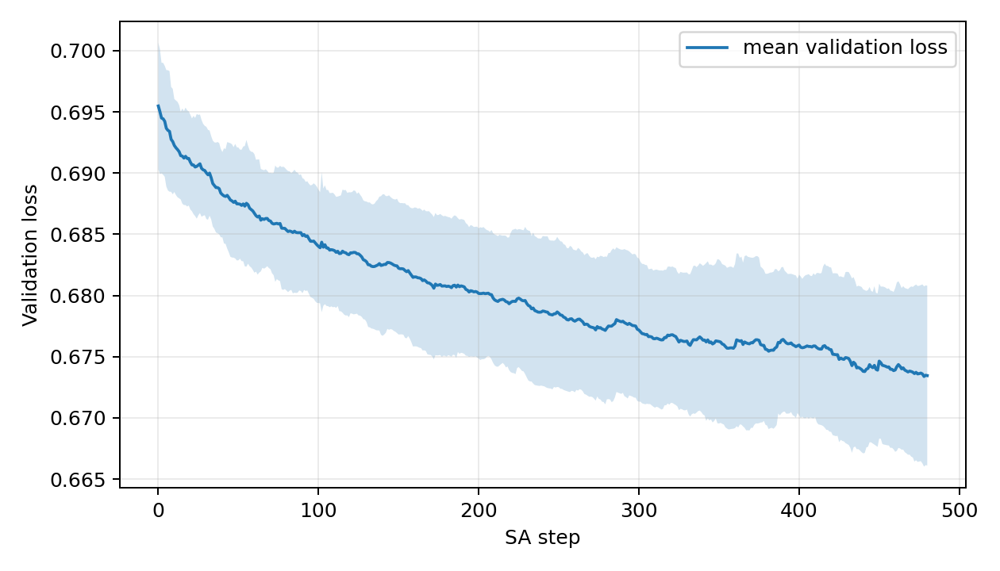

Der laufende Validation-Loss sinkt nur leicht von `0.6955` auf einen besten
beobachteten Wert von `0.6717`. Die Online-Suche bewegt sich, aber der spätere
Retraining-Vergleich zeigt praktisch keinen Layoutvorteil.

### 7.3 Acceptance Rate

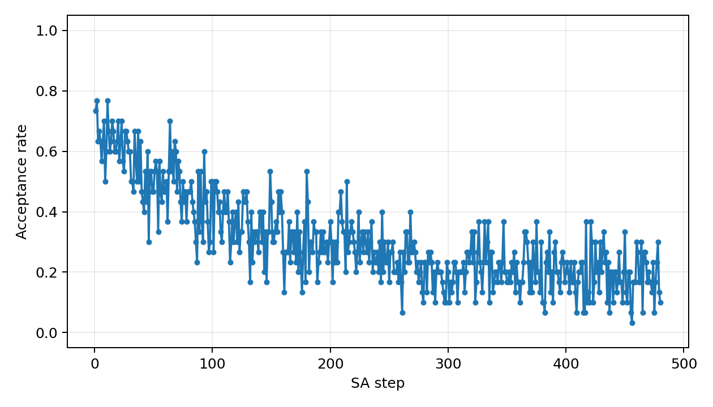

Die mittlere Acceptance Rate beträgt `0.3065`. Die Auswahl ist restriktiver als
bei `two_moons`, bleibt aber in einem plausiblen Bereich.

### 7.4 Delta-Verteilung und Temperatur

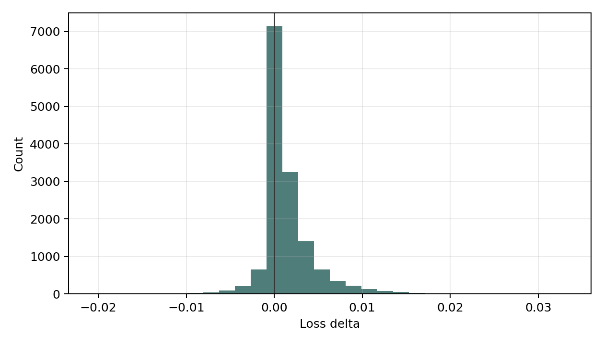

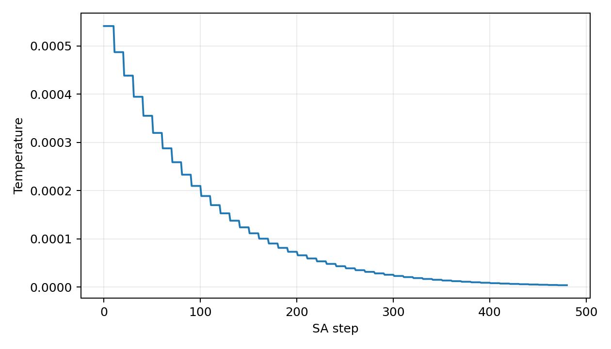

Die Delta-Skala ist deutlich kleiner als bei `two_moons`. Deshalb wurde eine
wesentlich niedrigere Starttemperatur (`0.0005410`) gewählt.

### 7.5 Aktivierungsfunktionen in Bestlayouts

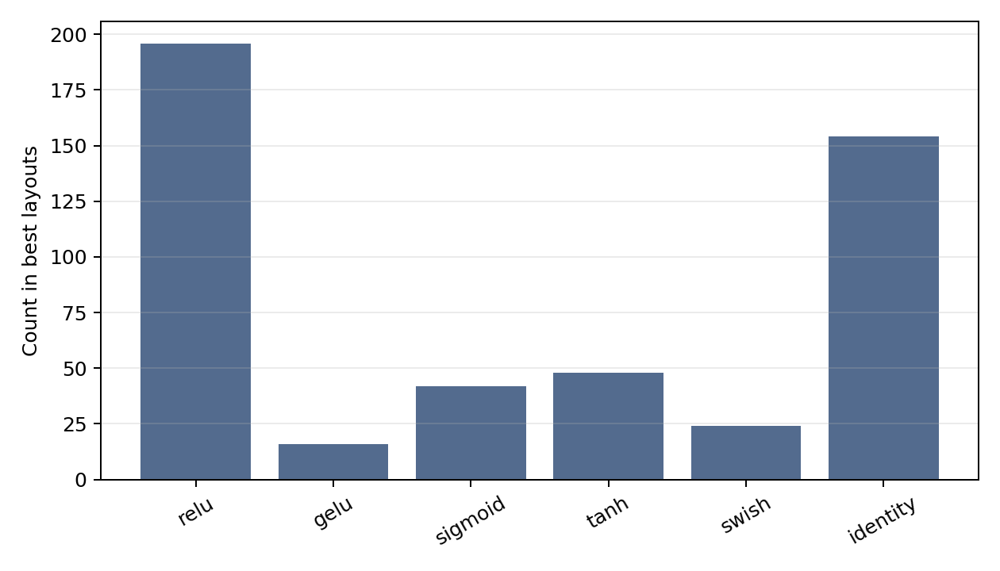

| AF | Anteil in den SA-Bestlayouts |
| --- | ---: |
| `relu` | `40.8 %` |
| `identity` | `32.1 %` |
| `tanh` | `10.0 %` |
| `sigmoid` | `8.8 %` |
| `swish` | `5.0 %` |
| `gelu` | `3.3 %` |

`relu` und `identity` dominieren die gefundenen Bestlayouts. Trotzdem beträgt
die mittlere normalisierte Hamming-Distanz `0.7125`. Es gibt also eine Tendenz
in der AF-Zusammensetzung, aber weiterhin kein einzelnes stabiles Ziel-Layout.

## 8. Benchmark: `crossing_spirals`

### 8.1 Ergebnis

`crossing_spirals` ist der schwierige Diagnose-Benchmark:

- Random-Baseline: `0.66226`
- Retrainiertes SA-Bestlayout: `0.70738`
- Paired Improvement: `-0.04512`
- Win Rate: `13 / 30`
- Beste homogene Referenz `all_relu`: `0.63821`

Die richtige Aussage ist:

> Unter der fixierten Basics-Topologie und einfachem SGD verschlechtert
> Online-Delta-SA die gepaarte Random-Baseline im Mittel. Für
> `crossing_spirals` liegt kein positives SA-Ergebnis vor.

### 8.2 Progress-Kurve

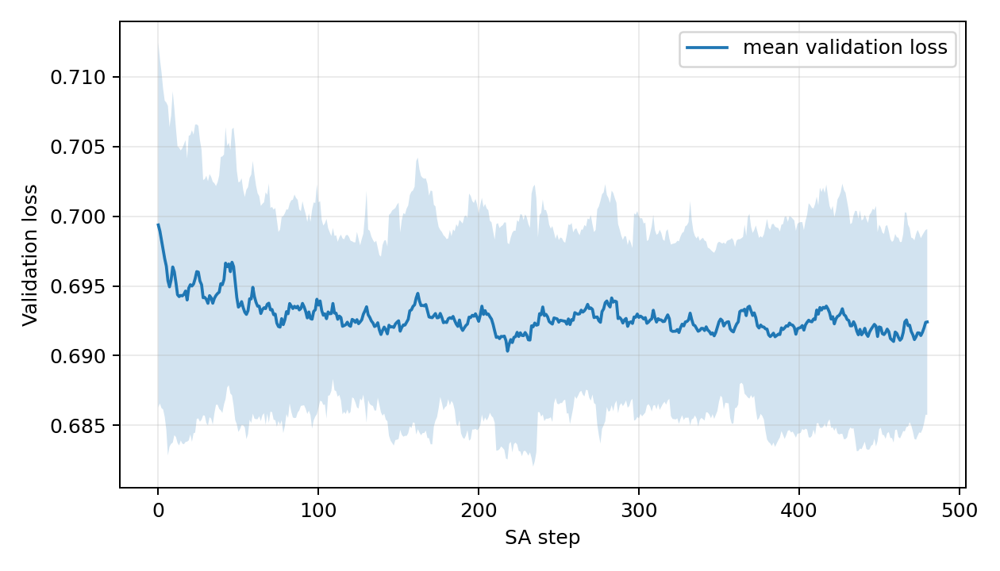

Der laufende Validation-Loss verbessert sich nur leicht von `0.6994` auf einen
besten beobachteten Wert von `0.6830`. Das ist deutlich schwächer als bei
`two_moons`. Das spätere Retraining zeigt zusätzlich eine negative mittlere
Layoutwirkung.

### 8.3 Acceptance Rate

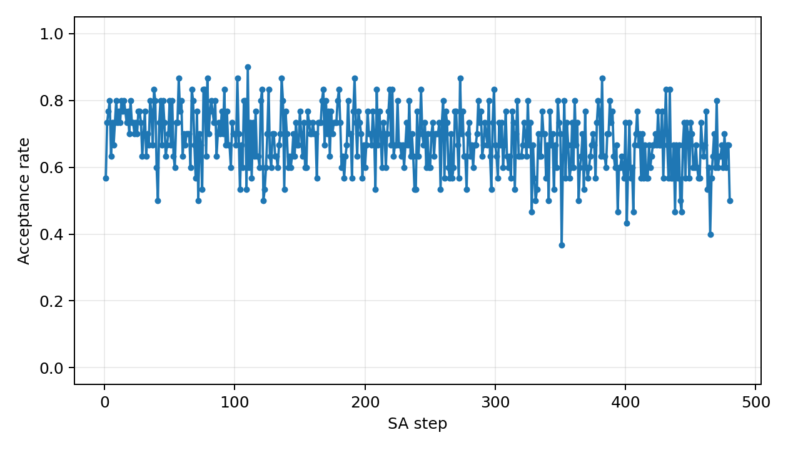

Die mittlere Acceptance Rate beträgt `0.6793`. Die Suche akzeptiert deutlich
mehr Kandidaten als auf den anderen Benchmarks. Zusammen mit der schwachen
Progress-Kurve spricht das für eine weniger selektive Suche.

### 8.4 Delta-Verteilung und Temperatur

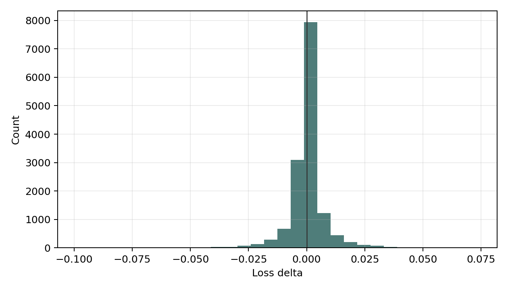

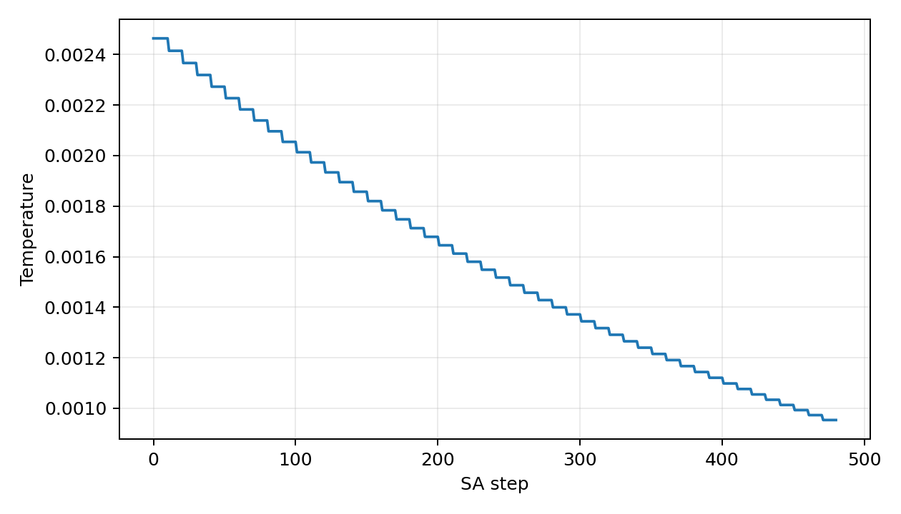

Das langsamere Cooling (`0.98`) hält die Suche länger explorativ. Unter den
getesteten Bedingungen führt diese Exploration jedoch nicht zu besser
retrainierbaren Layouts.

### 8.5 Aktivierungsfunktionen in Bestlayouts

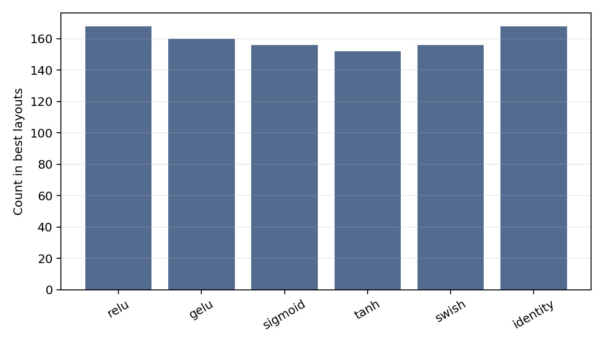

| AF | Anteil in den SA-Bestlayouts |
| --- | ---: |
| `relu` | `17.5 %` |
| `identity` | `17.5 %` |
| `gelu` | `16.7 %` |
| `sigmoid` | `16.3 %` |
| `swish` | `16.3 %` |
| `tanh` | `15.8 %` |

Die Verteilung ist nahezu gleichverteilt. Die mittlere normalisierte
Hamming-Distanz beträgt `0.8367`. Online-Delta findet weder eine dominante AF
noch ein stabiles Layoutmuster.

## 9. Gesamtinterpretation

Die Ergebnisse stützen keine allgemeine Behauptung, dass Online-Delta-SA bessere
Aktivierungs-Layouts als einfache Baselines findet.

| Benchmark | Befund |
| --- | --- |
| `two_moons` | kleines positives Signal gegenüber Random-Starts, aber schwächer als `all_gelu` |
| `concentric_circles` | praktisch neutral; Benchmark bereits fast gesättigt |
| `crossing_spirals` | negatives SA-Ergebnis; Random- und `all_relu`-Baseline stärker |

Die technisch belastbare Aussage lautet:

> Der implementierte Online-Delta-SA-Prozess ist reproduzierbar, numerisch
> beobachtbar und als Suchmechanismus funktionsfähig. Unter den untersuchten
> Basics-Bedingungen erzeugt er jedoch keinen konsistenten Vorteil gegenüber
> einfachen Random- oder homogenen Baselines.

Das ist ein fachlich verwertbares Ergebnis. Ein negativer oder neutraler Befund
ist besser als eine überzogene positive Aussage.

## 10. Seed-Einschraenkung

Die Confirmation-Runs verwenden `30` Run-Indizes (`0` bis `29`). Innerhalb
eines Runs wird derselbe Zahlenwert aktuell mehrfach verwendet:

```text
layout_seed = training_seed = split_seed = weight_seed = batch_seed = sa_seed
```

Der gepaarte Vergleich zwischen Random-Startlayout und SA-Bestlayout bleibt
dadurch grundsätzlich fair: Beide werden innerhalb eines Runs unter denselben
Trainingsbedingungen retrainiert.

Die Kopplung erschwert aber die saubere Trennung der Zufallseinflüsse. Vor einer
endgültigen Abgabe sollten die Zufallsquellen deterministisch aus einem
übergeordneten Run-Seed abgeleitet und die Confirmation-Runs erneut ausgeführt
werden.

## 11. Reproduktion

Die fixierten Parameter können mit dem Evaluationsprofil erneut ausgeführt
werden:

```bash
python main.py experiment suite \
  --evaluation-profile tuned_20260530 \
  --exp online-delta \
  --benchmark two_moons \
  --runs 30
```

Analog:

```bash
python main.py experiment suite --evaluation-profile tuned_20260530 --exp online-delta --benchmark concentric_circles --runs 30
python main.py experiment suite --evaluation-profile tuned_20260530 --exp online-delta --benchmark crossing_spirals --runs 30
```

Für die Referenzen:

```bash
python main.py experiment suite --evaluation-profile tuned_20260530 --exp random-baseline --benchmark two_moons --runs 30
python main.py experiment suite --evaluation-profile tuned_20260530 --exp all-baseline --benchmark two_moons --runs 30
```

Die beiden Referenzkommandos werden analog für die anderen Benchmarks
ausgeführt.

## 12. Quelldateien

Die numerischen Detailartefakte bleiben unter:

```text
outputs/hyperparameter_tuning/20260530_143043_overnight/confirmation/
```

Die für GitHub ausgewählten aggregierten Plotkopien liegen unter:

```text
docs/results/tuned_20260530/
```
